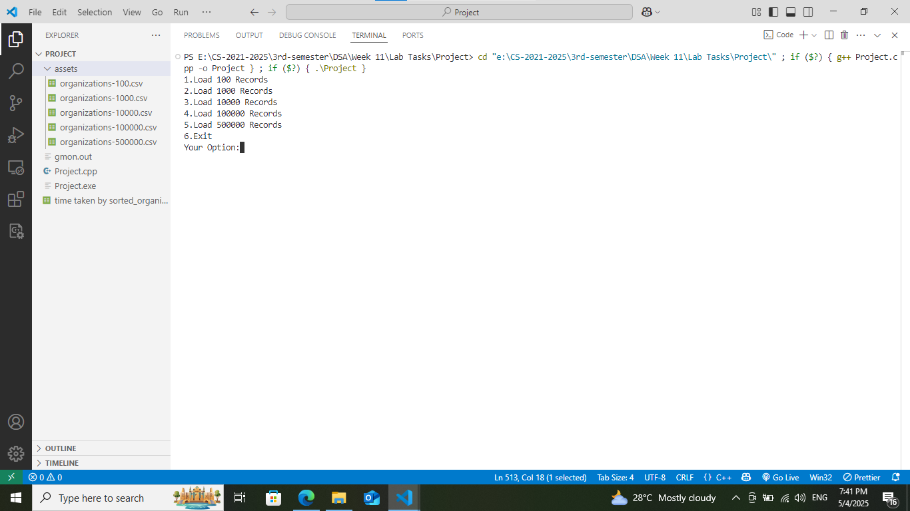
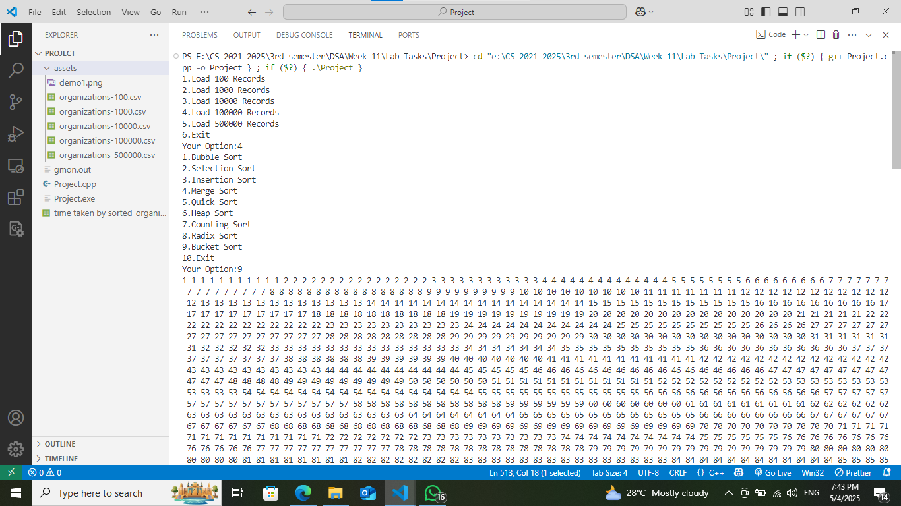

## sorting-algorithms-benchmark
A C++ project to compare the performance of common sorting algorithms (Bubble, Merge, Quick, etc.) on datasets ranging from 100 to 500,000 records.

## Setup
You must have a C++ setup. If you have the setup then just run `sorting-algorithms.cpp` file.

## Contributing
Contributions are welcome! To contribute:
- Fork the repository.
- Make your changes.
- Commit and push.
- Create a pull request.

## How It Looks?

## License
This project is licensed under the [MIT License](LICENSE).